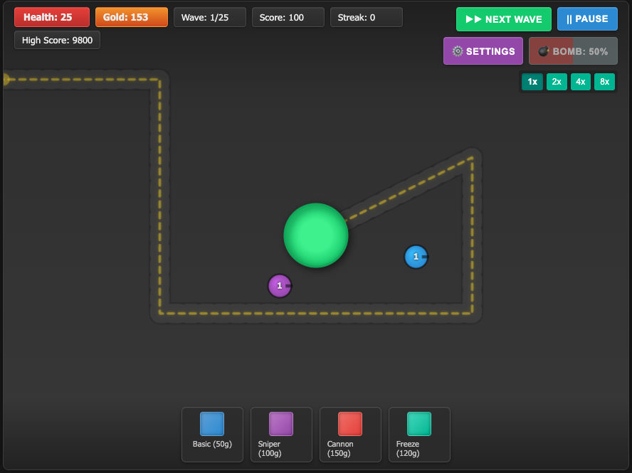

# Wave Defense Game

 A classic wave-based tower defense game built entirely with HTML, CSS, and vanilla JavaScript using the Canvas API. Place towers strategically to defend your base against increasingly difficult waves of enemies!

## Features

* **Classic Tower Defense:** Defend against waves of enemies marching along a path towards your base.
* **Multiple Tower Types:**
    * **Basic:** Standard all-rounder.
    * **Sniper:** High range, high damage, slow fire rate.
    * **Cannon:** Moderate damage, hits multiple targets.
    * **Freeze:** Low damage, slows ground enemies.
* **Tower Upgrades:** Improve tower stats (Damage, Range, Fire Rate) and unlock special abilities (Splash Damage, Pierce, Stun, Slow Aura) through multiple levels.
* **Diverse Enemies:** Face various enemy types with unique strengths and weaknesses (Grunt, Fast, Tank, Armored, Flyer, Healer).
* **Dynamic Paths:** The enemy path changes every 5 waves, requiring you to adapt your strategy and rebuild your defenses (towers are partially refunded).
* **Difficulty Levels:** Choose from Easy, Normal, or Hard modes affecting starting resources, enemy strength, and gold rewards.
* **Game Speed Control:** Play at 1x, 2x, 4x, or 8x speed.
* **Bomb Ability:** Charge a powerful bomb by defeating enemies and unleash it to damage all enemies on screen.
* **Kill Streaks:** Earn bonus gold for defeating multiple enemies in quick succession.
* **Interest:** Earn passive income based on your gold balance between waves.
* **Settings Menu:** Adjust SFX/Music volume, mute audio, toggle damage numbers and particle effects.
* **Persistent High Score:** Your highest score is saved locally using `localStorage`.
* **Visual Feedback:** Includes damage numbers, particle effects for explosions and firing, animations for UI changes, and visual indicators for tower range and status effects.
* **Responsive Design:** The game interface scales to fit different screen sizes while maintaining aspect ratio.

## How to Play

1.  **Select a Tower:** Click a tower button at the bottom of the screen. You can only select towers you can afford.
2.  **Place the Tower:** Move your mouse to the desired location on the map. A preview will show the tower and its range. The range circle will be green if the location is valid (not on the path, base, or too close to other towers) and red otherwise. Click to place the tower.
3.  **Cancel Placement:** Right-click anywhere on the game area while a tower is selected for placement to cancel.
4.  **Start the Wave:** Click the "Start Wave" button (or "Next Wave" button between waves) to begin the enemy assault. The path changes every 5 waves, requiring you to click "Start Wave" again after rebuilding.
5.  **Manage Towers:** Click an existing tower on the map to open its management panel.
    * **Upgrade:** If the tower isn't max level and you have enough gold, click "Upgrade" to improve its stats.
    * **Sell:** Click "Sell" to remove the tower and get a partial refund based on its total invested cost.
    * Click anywhere else on the map to close the panel.
6.  **Use the Bomb:** When the Bomb button is fully charged (indicated by the progress bar and "Ready!" text), click it to damage all enemies currently on screen.
7.  **Control Speed:** Use the speed buttons (1x, 2x, 4x, 8x) at the top right to adjust the game speed.
8.  **Pause/Resume:** Click the Pause/Resume button to toggle the game state.
9.  **Settings:** Click the Settings (⚙️) button to open the settings menu for audio/visual adjustments and difficulty selection (requires restart).

## Difficulty Levels

* **Easy:** Enemies have less health and move slower. You start with more gold and health. Gold rewards are increased.
* **Normal:** Standard balanced difficulty.
* **Hard:** Enemies have more health and move faster. You start with less gold and health. Gold rewards are reduced.
_Note: Changing difficulty requires restarting the game via the Settings menu or Game Over/Victory screen for the changes to take full effect._

## Towers

* **Basic (50g):** Standard damage and fire rate. Hits Ground & Flying. Upgrades improve stats and add splash damage at max level.
* **Sniper (100g):** High range, high damage, slow fire rate. Hits Ground & Flying. Upgrades improve stats and add piercing capability at max level.
* **Cannon (150g):** Moderate damage, hits multiple targets simultaneously. Hits Ground & Flying. Upgrades improve stats, increase target count, and add a chance to stun at max level.
* **Freeze (120g):** Low damage, significantly slows enemies. Hits Ground only. Upgrades improve stats, strengthen the slow effect, and add a slowing aura at max level.

## Enemies

* **Grunt:** Standard ground unit.
* **Fast:** Moves quickly, lower health. Ground unit.
* **Tank:** Slow but high health. Ground unit.
* **Armored:** Moderate health with armor that reduces incoming damage (less effective against cannon/bomb, more effective against basic/freeze). Ground unit.
* **Flyer:** Flies directly towards the base, ignoring the path. Can only be hit by towers that target flying units (Basic, Sniper, Cannon).
* **Healer:** Slowly heals nearby damaged ground units. Ground unit.

## Running Locally

This is a client-side game using only HTML, CSS, and JavaScript. No build process or server is required.

1.  Clone or download this repository.
2.  Open the `index.html` (or the main HTML file name) in your web browser.

That's it! The game should run directly.

## Technologies Used

* HTML5
* CSS3 (including CSS Variables, Flexbox, Animations)
* JavaScript (ES6+)
    * Canvas API for rendering
    * Web Audio API for sound effects
    * `localStorage` for high score persistence

## Contributing

Contributions are welcome! Feel free to fork the repository, make improvements, and submit a pull request. Some potential ideas for improvement:

* Add background music.
* Implement more complex sound effects or use sound libraries.
* Add more tower or enemy types.
* Create boss waves.
* Improve visual effects and animations.
* Refactor code for better organization or performance.
* Add unit tests.

## License

This project is licensed under the MIT License - see the [LICENSE.md](LICENSE.md) file for details (if you create one).
